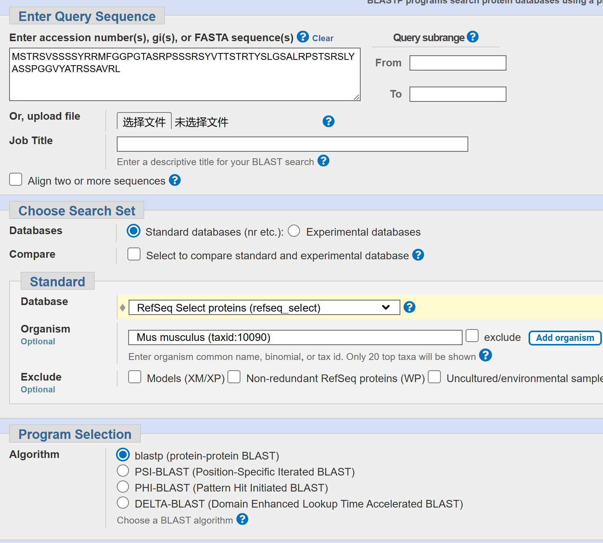
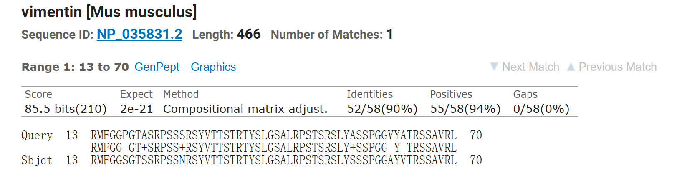

# Homework 3: BLAST

*致理-生21 雷丹*   

作业要求
```
对于序列MSTRSVSSSSYRRMFGGPGTASRPSSSRSYVTTSTRTYSLGSALRPSTSRSLYASSPGGVYATRSSAVRL:

1) 请使用网页版的 blastp, 将上面的蛋白序列只与 mouse protein database 进行比对， 设置输出结果最多保留10个， E 值最大为 0.5。将操作过程和结果截图，并解释一下 E value和 P value 的实际意义。

2) 请使用 Bash 脚本编程：将上面的蛋白序列随机打乱生成10个， 然后对这10个序列两两之间进行 blast 比对，输出并解释结果。（请上传bash脚本，注意做好重要code的注释；同时上传一个结果文件用来示例程序输出的结果以及你对这些结果的解释。）

注： blast的网站会提供多个mouse的databases，可以任选1个进行比对；也可以重复几次，每次选一个不同的database看看不同的输出结果，可以在作业中比较和讨论一下输出结果不同的原因。

3）解释blast 中除了动态规划（dynamic programming）还利用了什么方法来提高速度，为什么可以提高速度。

4）我们常见的PAM250有如下图所示的两种（一种对称、一种不对称），请阅读一下 "Symmetry of the PAM matrices" @ wikipedia，再利用Google/wikipedia等工具查阅更多资料，然后总结和解释一下这两种（对称和不对称）PAM250不一样的原因及其在应用上的不同。
```

### 1. 网页版blast，输出十个   
**操作过程**

**输出结果**
   

**E value：**
衡量整个搜索中出现假阳性的期望次数，如E=0.001表示每1000次搜索可能偶然出现1次）   
**P value:**
单次匹配的偶然性，即在随机情况下，单次比对中获得的得分（Alignment Score）出现的概率。例如，若某比对的P值为1e-5（即0.00001），意味着随机产生此得分的概率是0.001%。  

不同的database会导致不同的输出。默认的NR（Non-Redundant）数据库，包含GenBank、EMBL、DDBJ等多个来源的序列，冗余度高（同一蛋白可能有多条记录），输出结果会包括多个相同序列。refseq数据库包含经过人工审核、注释权威的蛋白序列，输出更加精准。


### 2. 请使用 Bash 脚本编程：将上面的蛋白序列随机打乱生成10个， 然后对这10个序列两两之间进行 blast 比对，输出并解释结果。
bash脚本如下：
```bash
#!/bin/bash
sequence="MSTRSVSSSSYRRMFGGPGTASRPSSSRSYVTTSTRTYSLGSALRPSTSRSLYASSPGGVYATRSSAVRL"
# 起始位置
si=0
# 终点位置
L=${#sequence}
ei=$(($L-1))

# 定义数组
arr=()
# 设置数组大小
size=10

# 填充数组
for ((i=0;i<size;i++))
do
    arr[i]=""
    # 生成随机的索引，打乱顺序
    for j in $(seq $si $ei | shuf)
    do
        arr[i]="${arr[i]}${sequence:$j:1}"
    done
done

# 执行blastp并将结果追加到 result.txt
for ((i=0;i<size;i++))
do
    for((j=i+1;j<size;j++))
    do
        blastp -query <(echo -e ">query_$i\n${arr[i]}") \
            -subject <(echo -e ">subject_$j\n${arr[j]}") \
            -outfmt "6 qseqid sseqid pident length mismatch gapopen evalue bitscore" \
            >> result.txt 2>&1
    done
done

exit 0
```
**结果文件（仅部分）**
```xlsx
query_0	subject_3	40.000	10	6	0	4.9	10.0
query_1	subject_3	44.444	9	5	0	1.9	11.2
query_1	subject_4	50.000	8	4	0	9.2	 9.2
query_1	subject_5	45.455	11	6	0	5.6	10.0
query_1	subject_5	32.000	25	9	1	8.0	 9.6
query_1	subject_7	46.154	13	7	0	0.24	13.5
query_1	subject_7	46.154	13	7	0	1.3	11.5
query_1	subject_7	60.000	5	2	0	2.9	10.8
query_1	subject_8	60.000	10	4	0	1.4	11.5
query_1	subject_9	63.636	11	4	0	2.4	10.8
query_2	subject_3	57.143	21	5	1	0.089	14.6
query_2	subject_3	38.462	13	8	0	1.0	11.9
query_2	subject_3	60.000	10	4	0	5.5	10.0
query_2	subject_4	80.000	5	1	0	1.5	11.5
```
| **列编号** | **列名**   | **含义** |
|-----------|-----------|---------|
| 1 | `qseqid`  | 查询序列的 ID（query ID） |
| 2 | `sseqid`  | 目标序列的 ID（subject ID） |
| 3 | `pident`  | 序列相似度（%），即匹配片段中相同的氨基酸占比 |
| 4 | `length`  | 比对长度（比对片段的总长度，包含匹配、错配和插入缺失） |
| 5 | `mismatch` | 错配数量（比对片段中不同的氨基酸个数） |
| 6 | `gapopen`  | 空位（gap）数量（比对时插入/删除的片段数） |
| 7 | `evalue`  | E 值（期望值），数值越小表示比对结果越显著 |
| 8 | `bitscore` | 比对分值（越高表示比对越可靠） |

随机打乱的序列间仍可能存在短片段的匹配，但多数比对得分较低，E 值较高，高匹配率（>50%）的情况较少。然而，由于氨基酸组成有限，偶然出现局部匹配是正常的。E 值大于 1 的比对大多是随机匹配，这些比对可能没有实际的生物学意义。同时，比对分值（bitscore）较低，说明这些序列彼此之间并没有显著的同源关系。总体而言，该实验证明，在随机打乱的序列中，BLASTP 仍然可以找到局部短片段的匹配，但大多数比对缺乏显著性。这表明 BLASTP 需要在生物学背景下使用，而不适用于完全随机的序列比对。

### 3. 解释blast 中除了动态规划（dynamic programming）还利用了什么方法来提高速度，为什么可以提高速度。  

BLAST提高速度的方法包括种子-扩展策略，通过短片段快速筛选候选区域进行局部扩展比对，减少计算复杂度；统计过滤与阈值控制，通过计算统计显著性过滤低分比对，减少计算量；以及启发式算法与近似匹配，允许一定程度的错配以快速排除不可能的高分比对。这些方法将比对范围缩小，降低了时间复杂度，使大规模数据库搜索成为可能。

### 4. 我们常见的PAM250有如下图所示的两种（一种对称、一种不对称），请阅读一下 "Symmetry of the PAM matrices" @ wikipedia，再利用Google/wikipedia等工具查阅更多资料，然后总结和解释一下这两种（对称和不对称）PAM250不一样的原因及其在应用上的不同。  
对称与非对称PAM250矩阵的差异在于对称性假设的适用场景。对称PAM250矩阵适用于全局比对和中性进化模型分析，反映了无方向性的进化关系；而非对称PAM250矩阵适用于特定方向性进化研究，如病毒宿主适应，能更真实地反映实际替换的方向性差异。选择矩阵类型时需根据比对目标和进化模型的可逆性假设来决定。